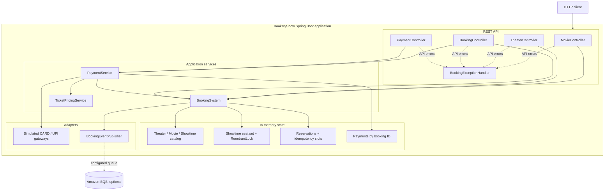

# High-level design

BookMyShow is one Spring Boot process. `BookingApplication` creates two sample theaters and their showtimes at startup. Spring MVC routes HTTP requests to four controllers. Booking and payment services operate on in-memory state. Card and UPI gateways are simulations. Only the optional booking event publisher connects to an external service (Amazon SQS).

## Main behavior

| Area | Endpoint | Implementation |
| --- | --- | --- |
| Movie search | `GET /v1/movies/search?title=&language=&city=` | Searches future showtimes through `BookingSystem.searchMovies`. Filters are optional. |
| Theater search | `GET /v1/theaters/search?city=Mumbai` | Finds theaters in a city. |
| Theater schedule | `GET /v1/theaters/{theaterId}/showtimes` | Lists future showtimes at a theater. |
| Booking | `POST /v1/bookings` | Requires `Idempotency-Key`; reserves all requested seats under the showtime lock. |
| Quote and payment | `GET /v1/bookings/{id}/quote`, `POST /v1/bookings/{id}/payments` | Applies configured discounts and selects a simulated card or UPI gateway. |
| Cancellation | `DELETE /v1/bookings/{id}` | Releases seats only for an unpaid booking. |

The lock prevents two requests in this process from reserving the same seat. It does not coordinate multiple application instances. The proposed database constraints in [schema.md](schema.md) describe a future persistent design; they are not active in this application.
