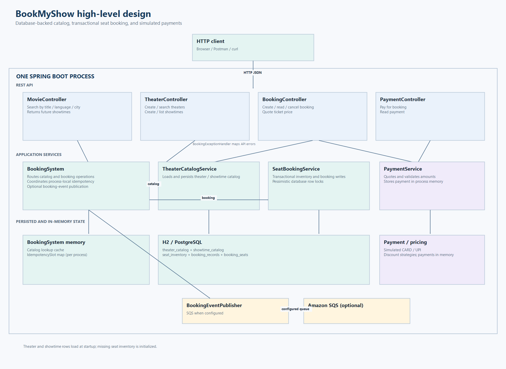

# High-level design



BookMyShow is one Spring Boot process. Theater and showtime catalog data are loaded from the configured database; booking records and seat inventory are persisted there as well. Spring MVC routes HTTP requests to the controllers. Payment records and idempotency slots remain in memory; card and UPI gateways are simulations. Only the optional booking event publisher connects to an external service (Amazon SQS).

```mermaid
flowchart TB
    Client[HTTP client]
    subgraph App[BookMyShow Spring Boot application]
        subgraph API[REST API]
            MC[MovieController]
            TC[TheaterController]
            BC[BookingController]
            PC[PaymentController]
            EH[BookingExceptionHandler]
        end
        subgraph Services[Application services]
            BS[BookingSystem]
            CatalogService[TheaterCatalogService]
            SeatService[SeatBookingService]
            PS[PaymentService]
            TP[TicketPricingService]
        end
        subgraph State[Persisted and in-memory state]
            Catalog[Theater / Movie / Showtime catalog]
            Seats[Seat inventory]
            Bookings[Booking records]
            Idempotency[Idempotency slots (memory)]
            Payments[Payments by booking ID]
        end
        subgraph Adapters[Adapters]
            GW[Simulated CARD / UPI gateways]
            PUB[BookingEventPublisher]
        end
    end
    SQS[(Amazon SQS, optional)]
    Client --> API
    MC & TC & BC --> BS
    BC & PC --> PS
    PS --> BS
    BS --> CatalogService & SeatService & Idempotency & PUB
    CatalogService --> Catalog
    SeatService --> Seats & Bookings
    PS --> TP & Payments & GW
    Catalog & Seats & Bookings --> DB[(H2 / PostgreSQL)]
    PUB -. configured queue .-> SQS
    MC & TC & BC & PC -. API errors .-> EH
```

## Main behavior

| Area | Endpoint | Implementation |
| --- | --- | --- |
| Movie search | `GET /v1/movies/search?title=&language=&city=` | Searches future showtimes through `BookingSystem.searchMovies`. Filters are optional. |
| Theater search | `GET /v1/theaters/search?city=Mumbai` | Finds theaters in a city. |
| Theater management | `GET/POST /v1/theaters` | Lists theaters or persists a new theater. |
| Theater schedule | `GET /v1/theaters/{theaterId}/showtimes` | Lists future showtimes at a theater. |
| Show management | `POST /v1/theaters/{theaterId}/showtimes` | Creates and persists a future showtime. |
| Booking | `POST /v1/bookings` | Requires `Idempotency-Key`; reserves all requested seats in a database transaction. |
| Quote and payment | `GET /v1/bookings/{id}/quote`, `POST /v1/bookings/{id}/payments` | Applies configured discounts and selects a simulated card or UPI gateway. |
| Cancellation | `DELETE /v1/bookings/{id}` | Releases seats only for an unpaid booking. |

`SeatBookingService` uses JPA pessimistic write locks on requested `SeatInventory` rows and `BookingRecord` during cancellation. `@Transactional` keeps each lock through its availability check and database updates. Theater/showtime catalog rows, seat inventory, and bookings are persisted; idempotency state and payments remain in memory.

At startup, the `ApplicationRunner` calls `BookingSystem.initializeCatalog()`. `TheaterCatalogService` loads theater and showtime records, then `SeatBookingService` creates any missing inventory rows. Theater and show creation are supported; update/delete operations and staff authentication are not implemented.
