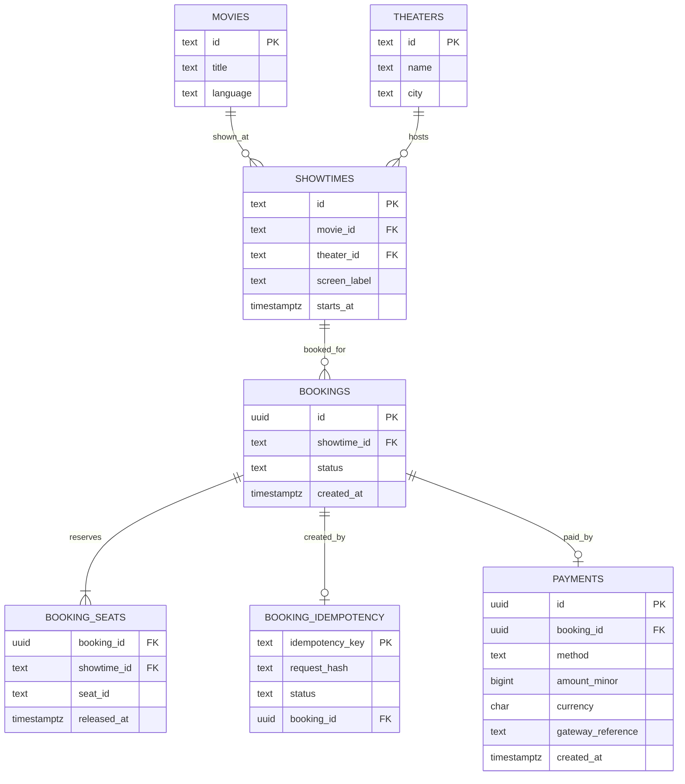

# Proposed persistence schema

**Status: design only.** The current BookMyShow application uses Java collections and does not connect to a database. The following PostgreSQL design shows how to persist the same concepts and enforce seat uniqueness across app instances.



## PostgreSQL DDL sketch

This SQL is a migration starting point, not a migration currently used by the project.

```sql
CREATE TABLE movies (
    id text PRIMARY KEY,
    title text NOT NULL,
    language text NOT NULL
);

CREATE TABLE theaters (
    id text PRIMARY KEY,
    name text NOT NULL,
    city text NOT NULL
);

CREATE TABLE showtimes (
    id text PRIMARY KEY,
    movie_id text NOT NULL REFERENCES movies(id),
    theater_id text NOT NULL REFERENCES theaters(id),
    screen_label text NOT NULL,
    starts_at timestamptz NOT NULL
);

CREATE TABLE bookings (
    id uuid PRIMARY KEY,
    showtime_id text NOT NULL REFERENCES showtimes(id),
    status text NOT NULL CHECK (status IN ('ACTIVE', 'CANCELLED')),
    created_at timestamptz NOT NULL DEFAULT now(),
    UNIQUE (id, showtime_id)
);

CREATE TABLE booking_seats (
    booking_id uuid NOT NULL,
    showtime_id text NOT NULL,
    seat_id text NOT NULL,
    released_at timestamptz,
    PRIMARY KEY (booking_id, seat_id),
    FOREIGN KEY (booking_id, showtime_id)
        REFERENCES bookings(id, showtime_id)
);

CREATE UNIQUE INDEX one_active_booking_per_seat
    ON booking_seats (showtime_id, seat_id)
    WHERE released_at IS NULL;

CREATE TABLE booking_idempotency (
    idempotency_key text PRIMARY KEY,
    request_hash text NOT NULL,
    status text NOT NULL CHECK (status IN ('IN_PROGRESS', 'SUCCEEDED')),
    booking_id uuid UNIQUE REFERENCES bookings(id),
    updated_at timestamptz NOT NULL DEFAULT now(),
    CHECK ((status = 'IN_PROGRESS' AND booking_id IS NULL)
        OR (status = 'SUCCEEDED' AND booking_id IS NOT NULL))
);

CREATE TABLE payments (
    id uuid PRIMARY KEY,
    booking_id uuid NOT NULL UNIQUE REFERENCES bookings(id),
    method text NOT NULL CHECK (method IN ('CARD', 'UPI')),
    amount_minor bigint NOT NULL CHECK (amount_minor > 0),
    currency char(3) NOT NULL,
    gateway_reference text NOT NULL UNIQUE,
    created_at timestamptz NOT NULL DEFAULT now()
);
```

## Transaction rules for a database implementation

1. Insert all seats for one booking in one transaction. The partial unique index rejects a second active claim on the same `(showtime_id, seat_id)` even when different app instances race.
2. Commit the booking and successful idempotency-key result together. A retry with the same key and request hash returns that booking; a different request hash is a conflict. Expired `IN_PROGRESS` rows need recovery if a process crashes.
3. Cancellation marks the booking `CANCELLED` and sets `released_at` for its seats in one transaction. A paid booking requires a refund workflow before cancellation.
4. Store successful payments with one row per booking. A real gateway needs durable payment attempts, provider idempotency keys, and reconciliation for ambiguous charge results; those are outside the current simulator.
5. The current Java model uses `LocalDateTime` without a zone. A database migration must choose an explicit time zone before writing `starts_at` as `timestamptz`.
