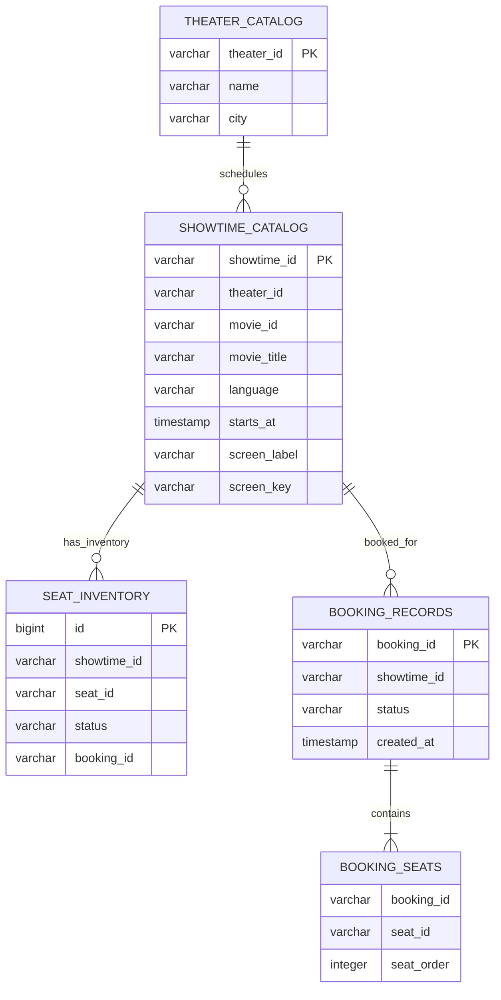

# Database schema

**Implemented persistence:** JPA/Hibernate creates and updates the schema from entity mappings (`spring.jpa.hibernate.ddl-auto=update`). Local development defaults to a persistent H2 file at `./data/bookmyshow`; configure `BOOKING_DB_URL`, `BOOKING_DB_USERNAME`, and `BOOKING_DB_PASSWORD` to connect to PostgreSQL or another supported database. This project does not currently use versioned schema migrations.

## Current tables

The implemented tables and important constraints are:

| Table | Columns and constraints |
| --- | --- |
| `theater_catalog` | `theater_id` primary key, `name`, `city` |
| `showtime_catalog` | `showtime_id` primary key, `theater_id`, `movie_id`, `movie_title`, `language`, `starts_at`, `screen_label`, `screen_key`; unique `(theater_id, screen_key, starts_at)` |
| `seat_inventory` | Generated `id` primary key, `showtime_id`, `seat_id`, `status`, nullable `booking_id`; unique `(showtime_id, seat_id)` |
| `booking_records` | `booking_id` primary key, `showtime_id`, `status`, `created_at` |
| `booking_seats` | `booking_id`, ordered `seat_id` values, generated `seat_order`; unique `(booking_id, seat_id)` |

`showtime_catalog.screen_key` is derived from the trimmed, lower-case screen label, so schedule uniqueness is case-insensitive for screen names. The catalog entities currently store IDs as scalar columns rather than JPA foreign-key associations. Movies are represented by fields on each showtime; there is no separate movie table. The `booking_seats` table is an eager element collection owned by `BookingRecord`.

The diagram shows logical catalog and booking relationships. Theater/showtime, inventory/showtime, and booking/showtime IDs are scalar columns without mapped foreign-key associations; `booking_seats.booking_id` is the collection join column owned by `BookingRecord`.

## Booking and cancellation concurrency

On startup, the app loads theater/showtime catalog rows into an in-memory lookup and initializes inventory rows for any missing seats. Each showtime currently has rows for seats A0–Z20.

`SeatBookingService.book()` validates and sorts seat IDs, then `SeatInventoryRepository.lockSeats()` selects the requested rows with `@Lock(LockModeType.PESSIMISTIC_WRITE)`. Inside the same `@Transactional` method it checks that every row is available, creates the booking record, updates the seat rows, and flushes. The database holds the selected row locks until the transaction commits or rolls back. If any requested seat is already booked, the operation fails and the transaction rolls back as a unit. Different requests can proceed independently when they do not overlap seats.

Cancellation locks the booking row with `BookingRecordRepository.lockByBookingId()`, then locks its seat rows, verifies they still belong to that booking, releases them, and marks the booking cancelled in one transaction. Payment records and idempotency-key results are currently held in memory, not in these tables.

## Scope and operational limitations

- Theater and showtime records, inventory, and booking records persist across restarts.
- There are no theater or show update/delete endpoints; theater and show creation are supported.
- Booking idempotency is only coordinated within one running application process. Persist it if retries must be safe across restarts or multiple instances.
- Payment records are in memory, and card/UPI gateways are simulations.
- There is no staff authentication/authorization; protect theater management endpoints before public deployment.
- `LocalDateTime` is stored without a zone. A production schema should define the intended time zone and use an explicit zoned/UTC representation.
- For production, replace automatic schema updates with reviewed Flyway/Liquibase migrations and connect every application instance to the same database.
