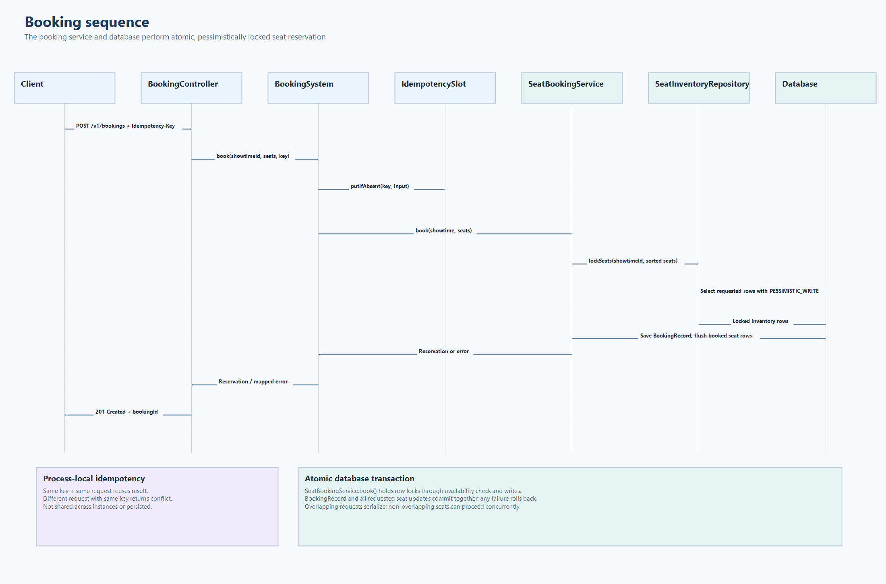

# Sequence diagrams



The PNG shows booking creation. The Mermaid source below also records the payment and cancellation flows.

## Create a booking

```mermaid
sequenceDiagram
    actor Client
    participant API as BookingController
    participant BS as BookingSystem
    participant Slot as IdempotencySlot
    participant Service as SeatBookingService
    participant Seats as SeatInventoryRepository
    participant Records as BookingRecordRepository
    participant DB as Database
    participant Events as BookingEventPublisher
    Client->>API: POST /v1/bookings + Idempotency-Key
    API->>BS: book(showtimeId, seatIds, key)
    BS->>Slot: putIfAbsent(key, input)
    alt same key and same request
        Slot-->>BS: await original result
        BS-->>API: original reservation
    else same key and different request
        BS-->>API: conflict
    else new key
        BS->>Service: book(showtime, seatIds)
        activate Service
        Service->>Service: validate and sort seat IDs
        Service->>Seats: lockSeats(showtimeId, seatIds)
        Seats->>DB: SELECT requested seats FOR UPDATE
        Note over Seats,DB: JPA PESSIMISTIC_WRITE locks the requested rows
        DB-->>Seats: locked seat inventory
        Seats-->>Service: seat entities
        alt seat missing or already booked
            Service-->>BS: error (transaction rolls back)
            deactivate Service
            BS->>Slot: fail and remove key
            BS-->>API: 400 invalid seat or 409 unavailable
        else seats available
            Service->>Records: save BookingRecord
            Service->>Seats: mark seats BOOKED
            Service->>DB: commit booking and seat updates
            DB-->>Service: commit
            Service-->>BS: Reservation
            deactivate Service
            BS->>Events: publish BOOKING_CREATED if SQS configured
            Note over BS,Events: Publish failure is logged; booking stays created
            BS->>Slot: completeSuccess(reservation)
            BS-->>API: reservation
            API-->>Client: 201 Created + bookingId
        end
    end
```

The seat-row locks and booking writes share the `@Transactional` boundary in `SeatBookingService.book()`. Overlapping requests wait on shared seat rows; after the first commits, the next request sees the booked state and fails, rolling back any other seats it requested.

## Quote and pay

```mermaid
sequenceDiagram
    actor Client
    participant API as BookingController / PaymentController
    participant PS as PaymentService
    participant BS as BookingSystem
    participant Records as BookingRecordRepository
    participant Pricing as TicketPricingService
    participant Gateway as PaymentGateway
    Client->>API: GET /v1/bookings/{id}/quote
    API->>PS: quote(bookingId)
    PS->>BS: getReservation(bookingId)
    BS->>Records: findById(bookingId)
    Records-->>BS: active BookingRecord
    BS-->>PS: Reservation
    PS->>Pricing: quote(reservation)
    Pricing-->>PS: PriceQuote
    PS-->>API: PriceQuote
    API-->>Client: totalAmountMinor
    Client->>API: POST /v1/bookings/{id}/payments
    API->>PS: pay(bookingId, method, amountMinor)
    PS->>PS: compare amount to quote; select CARD or UPI
    alt payment already exists
        PS-->>API: saved payment or conflict
    else first payment
        PS->>Gateway: charge(paymentId, amountMinor, INR)
        Gateway-->>PS: simulated gateway reference
        PS->>PS: save payment by booking ID
        PS-->>API: payment
        API-->>Client: 201 Created
    end
```

## Cancel an unpaid booking

```mermaid
sequenceDiagram
    actor Client
    participant API as BookingController
    participant PS as PaymentService
    participant BS as BookingSystem
    participant Service as SeatBookingService
    participant Bookings as BookingRecordRepository
    participant Seats as SeatInventoryRepository
    participant DB as Database
    Client->>API: DELETE /v1/bookings/{id}
    API->>PS: cancelUnpaidBooking(bookingId)
    alt payment exists
        PS-->>API: 409 refund required
    else unpaid
        PS->>BS: cancelReservation(bookingId)
        BS->>Service: cancel(bookingId)
        activate Service
        Service->>Bookings: lockByBookingId(bookingId)
        Bookings->>DB: SELECT booking FOR UPDATE
        DB-->>Bookings: active booking
        Bookings-->>Service: BookingRecord
        Service->>Seats: lockSeats(showtimeId, seatIds)
        Seats->>DB: SELECT requested seats FOR UPDATE
        DB-->>Seats: locked seats
        Seats-->>Service: seat entities
        Service->>Service: verify ownership; release seats; cancel booking
        Service->>DB: commit cancellation and inventory update
        DB-->>Service: commit
        deactivate Service
        API-->>Client: 204 No Content
    end
```
