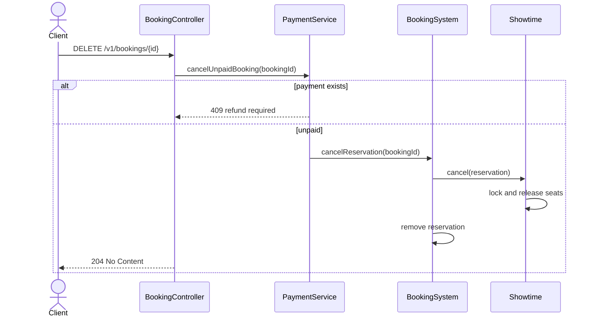

# Sequence diagrams


The PNG shows booking creation. The Mermaid source below also records the payment and cancellation flows.

## Create a booking

```mermaid
sequenceDiagram
    actor Client
    participant API as BookingController
    participant BS as BookingSystem
    participant Slot as IdempotencySlot
    participant Show as Showtime
    participant Events as BookingEventPublisher
    Client->>API: POST /v1/bookings + Idempotency-Key
    API->>BS: book(showtimeId, seatIds, key)
    BS->>Slot: putIfAbsent(key, input)
    alt same key and same request
        Slot-->>BS: await original result
        BS-->>API: original reservation
    else same key and different request
        BS-->>API: conflict
    else new key
        BS->>Show: book(reservation)
        Show->>Show: validate seats; tryLock(50 ms)
        alt busy or seat conflict
            Show-->>BS: error
            BS->>Slot: fail and remove key
            BS-->>API: 503 busy or 409 conflict
        else seats available
            Show->>Show: check and reserve under lock
            Show-->>BS: booked
            BS->>BS: save reservation in memory
            BS->>Events: publish BOOKING_CREATED if SQS configured
            Note over BS,Events: Publish failure is logged; booking stays created
            BS->>Slot: completeSuccess(reservation)
            BS-->>API: reservation
            API-->>Client: 201 Created + bookingId
        end
    end
```

## Quote and pay

```mermaid
sequenceDiagram
    actor Client
    participant API as BookingController / PaymentController
    participant PS as PaymentService
    participant BS as BookingSystem
    participant Pricing as TicketPricingService
    participant Gateway as PaymentGateway
    Client->>API: GET /v1/bookings/{id}/quote
    API->>PS: quote(bookingId)
    PS->>BS: getReservation(bookingId)
    PS->>Pricing: quote(reservation)
    Pricing-->>PS: PriceQuote
    PS-->>API: PriceQuote
    API-->>Client: totalAmountMinor
    Client->>API: POST /v1/bookings/{id}/payments
    API->>PS: pay(bookingId, method, amountMinor)
    PS->>PS: compare amount to quote; select CARD or UPI
    alt payment already exists
        PS-->>API: saved payment or conflict
    else first payment
        PS->>Gateway: charge(paymentId, amountMinor, INR)
        Gateway-->>PS: simulated gateway reference
        PS->>PS: save payment by booking ID
        PS-->>API: payment
        API-->>Client: 201 Created
    end
```

## Cancel an unpaid booking


