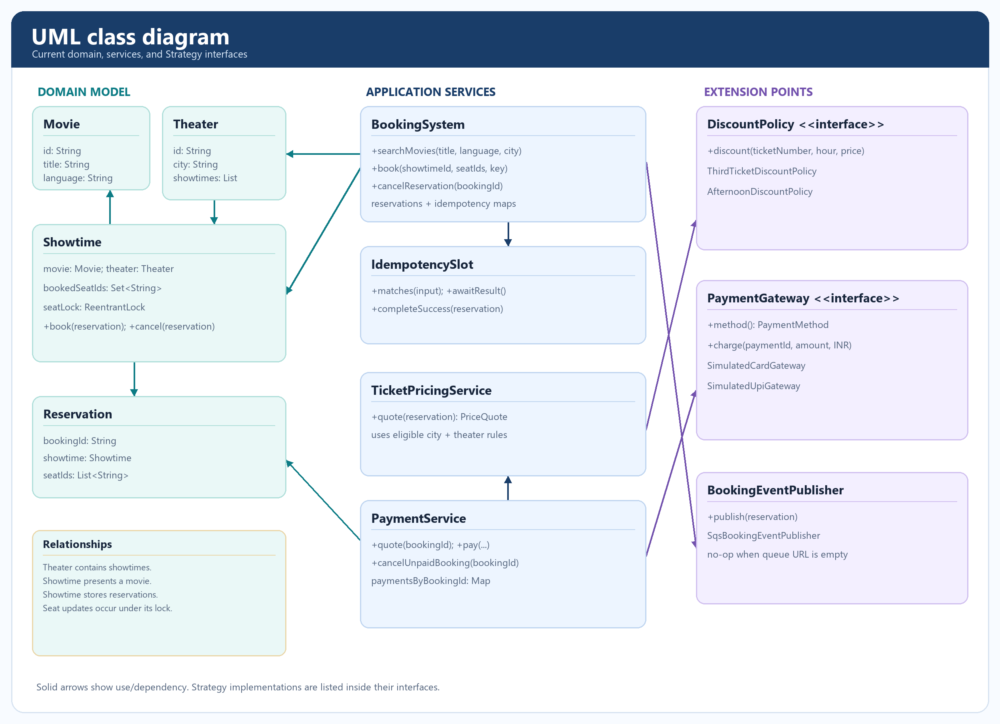
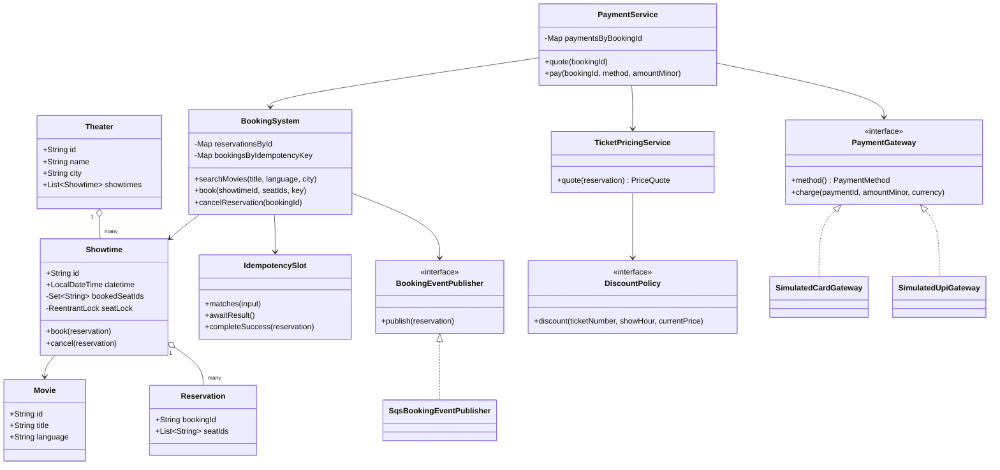

# UML class diagram

The diagram focuses on the classes that own booking, seat, pricing, and payment behavior. Request and response DTOs are omitted for readability.

`PaymentGateway` and `DiscountPolicy` use the Strategy pattern. `SqsBookingEventPublisher` is used only when a queue URL is configured.
